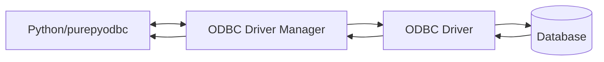

# purepyodbc

## What is this?

This project provides a "pure python" ODBC bridge. Or at least as "pure" as it can possibly be.

### Project aims

- Implement the [DB API 2.0](https://www.python.org/dev/peps/pep-0249) specification.
- Become API-equivalent to the well-known [pyodbc](https://github.com/mkleehammer/pyodbc).
- Act as a drop-in replacement for pyodbc for situations where C++ compilation is undesirable, or where pyodbc is otherwise not available.
- Users should be able to change `import pyodbc` to `import purepyodbc as pyodbc` and have it Just Work™.

### Project non-aims

- Performance (at least in the short- to mid-term)
- Features other than those offered by pyodbc

## Installation

### Python/pip

The easy bit is installing this package; You just `pip install purepyodbc`.

### ODBC setup

Here is a rough diagram showing how all the pieces hang together.

You will need an ODBC driver manager installed on your system. On Windows, you probably don't need to install anything. On Linux (and possibly macOS and other *nix-likes although we don't test it), unixODBC is probably best although others may work.

Once you've got that, you'll need one or more ODBC driver for whichever database(s) you want to talk to. Just as purepyodbc talks to the driver manager, the driver manager talks to the driver(s).

### Supported ODBC configurations

(To be expanded upon in due course)

| Operating System | Driver Manager |            Driver             | Database Server |
|:----------------:|:--------------:|:-----------------------------:|:---------------:|
|     Windows      |    Windows     | ODBC Driver 17 for SQL Server |   SQL Server    |
|     Windows      |    Windows     |          SQL Server           |   SQL Server    |
|     Windows      |    Windows     |      PostgreSQL Unicode       |   PostgreSQL    |
|      Linux       |    unixODBC    | ODBC Driver 17 for SQL Server |   SQL Server    |
|      Linux       |    unixODBC    |            FreeTDS            |   SQL Server    |
|      Linux       |    unixODBC    |      PostgreSQL Unicode       |   PostgreSQL    |

## Usage

This section is intentionally brief for now, as the project is very immature.

Anything you would normally do with pyodbc should be possible here.

If it's not, then raise an issue so I can track what people actually want.
